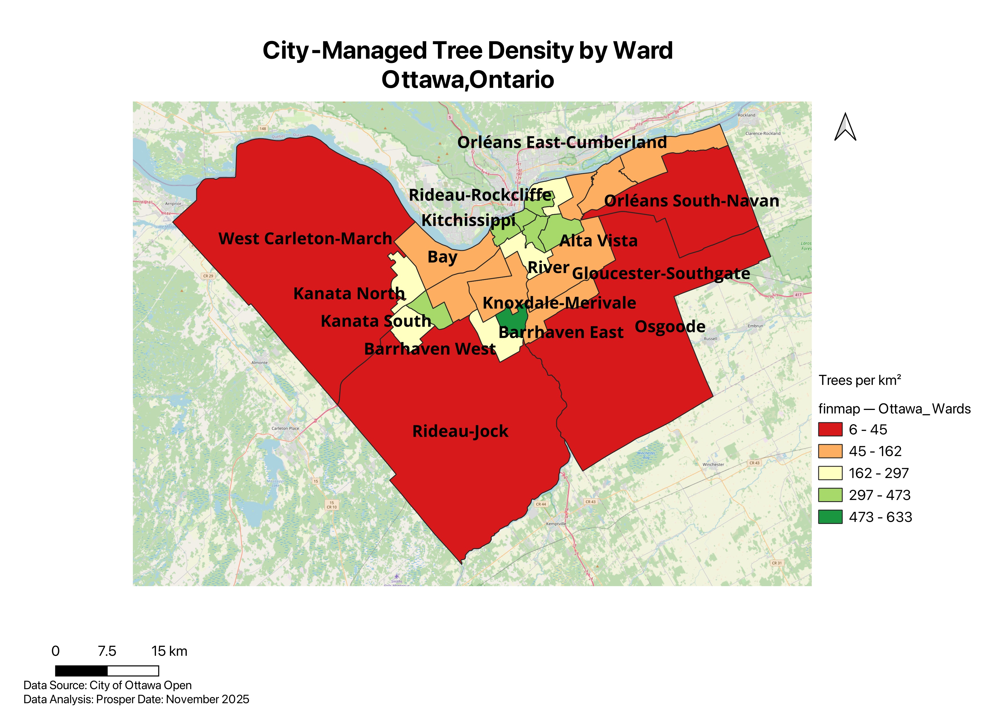

# Ottawa Urban Tree Equity Analysis

**Analyzing distribution of city-managed trees to identify coverage gaps and prioritize investment**

Spatial analysis examining distribution of 300k city-managed trees across Ottawa's 24 wards. Identified 26× equity gap between rural and urban areas.

---

## 📊 Project Overview

This spatial analysis examines the distribution of 299,592 city-managed trees across Ottawa's 24 municipal wards to identify equity gaps and inform tree planting priorities.

**Key Finding:** Rural wards have 26× fewer trees per km² than urban/suburban wards, revealing systematic underinvestment in rural tree coverage.

**Completion Date:** December 2025  
**Time Investment:** 20 hours  
**Tools:** QGIS, SQL, Excel

---

## 🎯 Key Findings

### Tree Density Map: Coverage Gaps Visualized

### Critical Findings:

- **Rural wards critically underserved:** 6-16 trees/km² vs. urban average of 268 trees/km²
- **100× coverage gap:** Osgoode (6 trees/km²) to Barrhaven East (633 trees/km²)
- **Rural wards identified as priority areas:** Osgoode, West Carleton-March, Rideau-Jock

**Surprising insight:** Despite abundant open space, rural wards show dramatically lower city-managed tree density than expected.

### Ward-by-Ward Comparison:

---

## 💡 Recommendations

**Primary Recommendation:** Prioritize rural ward tree planting investment

- **Target:** Increase rural density from 10 to 50 trees/km² (5× improvement)
- **Strategy:** Use urban/suburban wards (266-268 trees/km²) as templates
- **Focus areas:** Village centers, roadways, community facilities in rural wards

**Estimated need (top 3 priority wards):**
- Osgoode: ~55,000 trees
- West Carleton-March: ~64,000 trees
- Rideau-Jock: ~50,000 trees

---

## 🛠️ Methodology

**Data Sources:**
- City of Ottawa Tree Inventory (299,592 records, 2011-2025)
- Ottawa Ward Boundaries (2022-2026 system, 24 wards)

**Technical Approach:**
1. Spatial analysis in QGIS to visualize tree distribution
2. SQL aggregation to count trees by ward
3. Density calculation (trees/km²) for fair comparison across ward sizes
4. Statistical analysis (mean, median, range, standard deviation)
5. Comparative analysis by ward type (Urban, Suburban, Rural)

**Key methodological decision:** Used density metrics rather than raw counts because wards vary 100× in size (13 km² to 1,550 km²).

**Challenge solved:** Initial spatial intersection approach failed; pivoted to SQL aggregation with attribute-based joins for accurate results.

📄 **[Download Full Methodology (PDF)](Ottawa_Trees_Methodology_Final.pdf)** - Complete technical documentation

---

## 📁 Project Deliverables

**Click to download:**

- 📄 **[Executive Summary (PDF)](Executive_Summary_P1.pdf)** - 1-page overview of findings and recommendations
- 📄 **[Full Methodology (PDF)](Ottawa_Trees_Methodology_Final.pdf)** - Complete 8-section technical documentation
- 🗺️ **Tree Density Map** - Graduated symbology visualization (shown above)
- 📊 **Bar Chart** - Visual comparison of all 24 wards (shown above)
- 📈 **Statistical Analysis** - Descriptive statistics by ward and ward type (in methodology)

---

## 🔧 Skills Demonstrated

**Technical:**
- QGIS (spatial analysis, field calculations, data visualization)
- SQL (data aggregation and queries)
- Statistical analysis (descriptive statistics, group comparisons)
- Excel (charting, supplementary analysis)
- Data management and quality control

**Analytical:**
- Equity analysis and environmental justice assessment
- Problem-solving and methodology adaptation
- Density normalization for fair comparison
- Priority ranking and target-setting
- Transparent limitation reporting

---

## 📫 Contact

**Prosper Ocheme**  
GIS Analyst | Portfolio in Development

- LinkedIn: [linkedin.com/in/prosper-ocheme](https://linkedin.com/in/prosper-ocheme)
- Email: your.email@example.com
- Location: Ottawa, Ontario, Canada

*Available for collaboration, questions, or opportunities.*

---

## 📜 Data Sources

All data sourced from [City of Ottawa Open Data Portal](https://open.ottawa.ca/)

---

**Project Status:** Complete (December 2025)  
**Portfolio Project #1** of planned 10-project series

---

### 📊 Project Statistics

- **Trees Analyzed:** 299,592
- **Geographic Coverage:** 24 municipal wards, ~2,800 km²
- **Analysis Time:** 20 hours
- **Key Metric:** Trees per square kilometer (density)
- **Primary Tool:** QGIS 3.34
